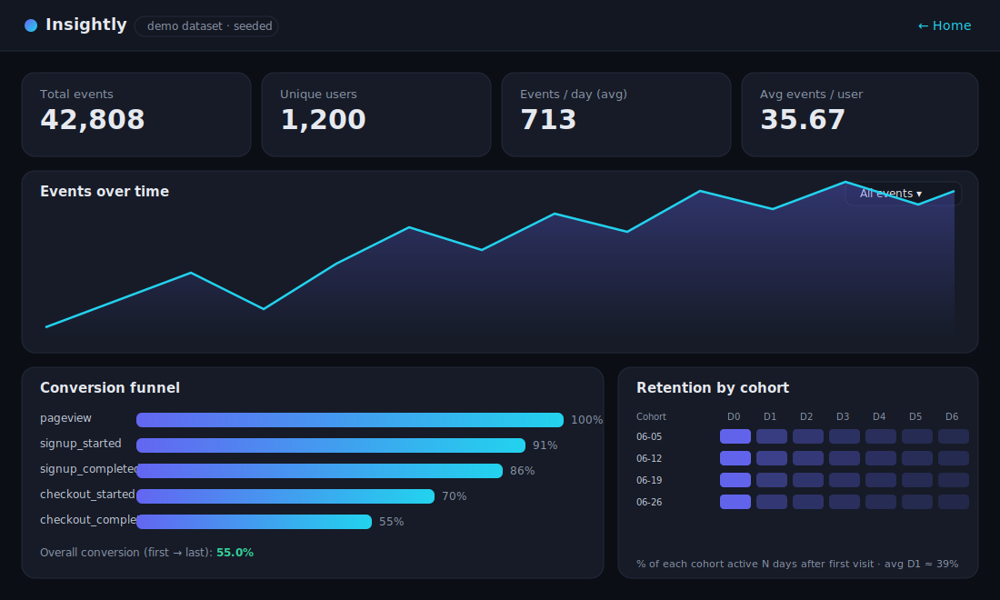
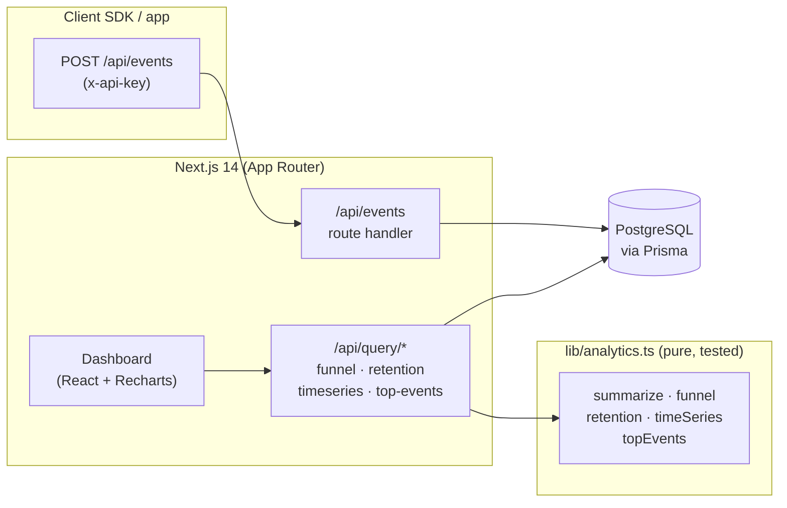

# Insightly — a mini-PostHog product-analytics SaaS

[](https://github.com/maddoxk/fullstack-saas-analytics/actions/workflows/ci.yml)
[](https://github.com/maddoxk/fullstack-saas-analytics/actions/workflows/pages.yml)
[](./LICENSE)

A self-hostable **product-analytics platform** (think a tiny [PostHog](https://posthog.com)):
ingest events via an API, then explore **funnels, retention cohorts, time-series trends and
top events** in an interactive dashboard.

Full stack: **Next.js 14 (App Router) · TypeScript · Prisma · PostgreSQL · Recharts.**

### ▶ [Live interactive demo →](https://maddoxk.github.io/fullstack-saas-analytics/)

The live demo is a **fully static export** that runs entirely in your browser on a bundled,
deterministically-seeded dataset (**~42,800 events · 1,200 users · 60 days**) — no server,
no database, no API calls. The exact same TypeScript aggregation functions power both the live
demo and the real full-stack server.



---

## Features

| Capability | Detail |
| --- | --- |
| **Event ingestion** | `POST /api/events` with per-project API keys, backed by Prisma + Postgres |
| **Conversion funnels** | Ordered, time-aware funnel — a step only counts if performed *at or after* the previous step |
| **Retention cohorts** | Day-by-day cohort retention keyed on each user's first-seen day |
| **Time-series** | Daily event count + unique users, filterable by event name |
| **Top events** | Ranked event breakdown with unique-user counts and share-of-total |
| **Static demo** | `output: 'export'` build that ships the dashboard with zero backend |

All aggregations live in [`lib/analytics.ts`](./lib/analytics.ts) as **pure, framework-agnostic,
fully unit-tested functions** (12 Vitest cases in [`__tests__/analytics.test.ts`](./__tests__/analytics.test.ts)).

---

## Architecture



**Two run modes, one codebase:**

- **Full-stack (server) mode** — events are written to Postgres through Prisma; the dashboard's
  `/api/query/*` endpoints read from the DB and run the aggregation functions server-side.
- **Static demo mode** (`NEXT_PUBLIC_STATIC_DEMO=true`) — `next build` produces a static export.
  The dashboard generates the seeded dataset client-side (same generator that seeds Postgres) and
  runs the *identical* aggregation functions in the browser. The `/api/*` routes degrade to inert
  static stubs so the export succeeds with no server.

```
app/
  api/
    events/route.ts            POST ingestion (Prisma)
    query/{funnel,retention,timeseries,top-events}/route.ts   GET query endpoints
  page.tsx                     marketing landing page
  dashboard/page.tsx           the analytics dashboard
components/                    KPI cards, time-series, funnel, retention heatmap, top events
lib/
  analytics.ts                 pure aggregation functions (unit-tested)
  mock-data.ts                 deterministic seeded event generator (mulberry32 PRNG)
  data-source.ts               client-safe data layer for the static demo
  db.ts                        Prisma singleton (server only)
prisma/
  schema.prisma                Project + Event models with composite indexes
  seed.ts                      loads ~43k realistic events into Postgres
```

---

## Run it

### Option A — Live static demo (zero setup)
Just open **<https://maddoxk.github.io/fullstack-saas-analytics/>**.

To build it locally:
```bash
npm install
npm run build:static     # NEXT_PUBLIC_STATIC_DEMO=true next build → ./out
npx serve out            # or any static server
```

### Option B — Full stack with Postgres
```bash
npm install
cp .env.example .env                 # DATABASE_URL points at the docker Postgres
docker compose up -d                 # start Postgres 16
npm run prisma:generate
npm run prisma:migrate               # create the schema
npm run seed                         # load ~43k realistic events
npm run dev                          # http://localhost:3000
```

Send an event:
```bash
curl -X POST http://localhost:3000/api/events \
  -H "content-type: application/json" \
  -H "x-api-key: demo-key" \
  -d '{"name":"checkout_completed","userId":"user_0001","properties":{"plan":"pro"}}'
```

Query the funnel:
```bash
curl "http://localhost:3000/api/query/funnel"
```

### Tests
```bash
npm test        # 12 Vitest cases covering every aggregation
```

---

## Tech stack

**Next.js 14** (App Router, route handlers, static export) · **TypeScript** · **Prisma 5** ·
**PostgreSQL 16** (docker-compose) · **Recharts** · **Vitest** · **GitHub Actions** (CI + Pages).

Pinned to Next 14 / React 18 for Node 18 compatibility; CI and Pages build on Node 20.

## License

MIT © 2026 Maddox Krape — see [LICENSE](./LICENSE).
